# ServiceNow Ticket Automation System

An intelligent, AI-powered system that automatically creates ServiceNow tickets from Gmail emails using a multi-agent workflow with Gemini AI integration.

## 🌟 Overview

This application automatically monitors a Gmail inbox, classifies incoming emails using AI, extracts relevant information, and creates ServiceNow tickets with appropriate categorization and assignment. It also tracks ticket status and sends notifications to users.

## 🚀 Features

- **AI-Powered Classification**: Uses Gemini 3 Flash Preview (`gemini-3-flash-preview`) to identify support-related emails
- **Smart Categorization**: Automatically categorizes tickets (IT, HR, Finance, Facilities, General)
- **Dynamic Assignment**: Assigns tickets to appropriate groups and users
- **Email Notifications**: Sends confirmation and closure emails to users
- **Real-time Tracking**: Monitors ticket status and updates stakeholders
- **Privacy-Focused**: Only reads email subjects initially, with fallback to limited body content
- **Configurable**: Easy configuration via YAML and environment variables

## 🛠️ Tech Stack

- **Backend Framework**: FastAPI
- **AI/ML**: Google Gemini 3 Flash Preview (`gemini-3-flash-preview`)
- **Email Processing**: IMAP for Gmail, SMTP for notifications
- **Ticketing System**: ServiceNow REST API
- **Scheduling**: APScheduler
- **Workflow Orchestration**: LangGraph StateGraph
- **Configuration**: YAML + Environment variables
- **Logging**: Custom structured logging

## 📁 Project Structure

```
app/
├── main.py                 # FastAPI application entry point
├── agents/                 # All agent implementations
│   ├── scheduler.py        # Main workflow orchestrator
│   ├── mail_fetcher.py     # Gmail IMAP integration
│   ├── classifier.py       # AI email classification
│   ├── summary.py          # AI summary generation
│   ├── category_extractor.py # AI category extraction
│   ├── servicenow.py       # ServiceNow API integration
│   ├── notification.py     # Email notifications
│   └── tracker.py          # Ticket status tracking
├── tools/                  # Utility modules
│   ├── email_utils.py      # Email processing utilities
│   ├── servicenow_api.py   # ServiceNow REST API client
│   └── config_loader.py    # Configuration management
├── config/                 # Configuration files
│   └── config.yaml         # Application settings
└── utils/                  # Common utilities
    └── logger.py           # Logging configuration
```

## 🔄 Workflow Details

1. **Email Fetching**: Checks Gmail every 10 minutes for unread emails
2. **AI Classification**: Uses Gemini (model `gemini-3-flash-preview`) to identify support-related emails
3. **Summary Generation**: Creates concise ticket descriptions from email content
4. **Category Extraction**: Determines appropriate category and priority
5. **Ticket Creation**: Creates ServiceNow tickets with proper assignment
6. **Notification**: Sends confirmation emails to users
7. **Tracking**: Monitors ticket status and sends closure notifications

## 📋 Example Input & Output

### Input Email Example
```
From: john.doe@company.com
Subject: Can't access the payroll system
Date: 2024-01-15 10:30:00

Body: Hi team, I'm unable to access the payroll system this morning. 
I keep getting an authentication error. Can you please help?
```

### Output ServiceNow Ticket
```json
{
  "ticket_number": "INC0012345",
  "short_description": "Payroll system access issue",
  "description": "User reports authentication errors when accessing payroll system...",
  "category": "HR",
  "subcategory": "Access",
  "priority": "2",
  "urgency": "2",
  "assignment_group": "Human Resources",
  "assigned_to": "hr.support@company.com",
  "caller": "john.doe@company.com"
}
```

### AI Classification Output
```json
{
  "category": "HR",
  "subcategory": "Access Management",
  "confidence": "high",
  "priority": "2",
  "urgency": "2",
  "reasoning": "Email mentions payroll system access issues, which falls under HR category"
}
```
## Architecture


## User flow

```mermaid
flowchart TD
    A[User Sends Support Email] --> B[Email Arrives in Gmail Inbox]
    B --> C{Automation System<br>Runs Every 10 Minutes}
    
    C --> D[Fetch Unread Emails]
    D --> E{Classifier Agent<br>Is this support-related?}
    
    E -- No --> F[Mark as Read<br>Ignore]
    E -- Yes --> G[Summary Agent<br>Generates Ticket Title & Desc]
    
    G --> H[Category Agent<br>Extracts Category, Priority, Urgency]
    H --> I[ServiceNow Agent<br>Creates Incident Ticket]
    
    I --> J[Notification Agent<br>Sends Confirmation Email to User]
    J --> K[Tracker Agent<br>Starts Monitoring Ticket Status]
    
    K --> L{ServiceNow Team<br>Works on Ticket}
    L --> M[Ticket Resolved & Closed]
    
    M --> N[Tracker Agent Detects Closure]
    N --> O[Notification Agent<br>Sends Resolution Email to User]
    O --> P[Process Complete ✅]
    
    style A fill:#f9f,stroke:#333,stroke-width:2px
    style P fill:#bbf,stroke:#333,stroke-width:2px
```


## 🚀 Installation

### Prerequisites
- Python 3.9+
- ServiceNow instance with API access
- Gmail account with app password
- Google Gemini API key

### Setup Steps

1. **Clone the repository**
   ```bash
   git clone <repository-url>
   cd servicenow-ticket-automation
   ```

2. **Create virtual environment**
   ```bash
   python -m venv venv
   source venv/bin/activate  # On Windows: venv\Scripts\activate
   ```

3. **Install dependencies**
   ```bash
   pip install -r requirements.txt
   ```

4. **Configure environment variables**
   ```bash
   cp .env.sample .env
   # Edit .env with your credentials
   ```

5. **Configure application settings**
   ```bash
   # Edit config/config.yaml with your ServiceNow and category mappings
   ```

6. **Run the application**
   ```bash
   python3 ./main.py
   ```

### Jira Integration & Port Forwarding
To enable Jira webhooks to communicate with the local agent, port forwarding is required.
**Current DevTunnel URL:** `https://xj6mg14p-8000.inc1.devtunnels.ms/`

Ensure this URL is configured in your Jira webhook settings to point to `/rest/webhooks/webhook1`.

## ⚙️ Configuration

### Environment Variables (.env)
```ini
# Gmail Configuration
GMAIL_EMAIL=your-email@gmail.com
GMAIL_APP_PASSWORD=your-app-password

# ServiceNow Configuration  
SERVICENOW_INSTANCE_URL=https://your-instance.service-now.com
SERVICENOW_USERNAME=your-username
SERVICENOW_PASSWORD=your-password

# GROQ AI Configuration
GROQ_API_KEY=your-groq-api-key

# SMTP Configuration
SMTP_SERVER=smtp.gmail.com
SMTP_PORT=587
SMTP_USERNAME=your-email@gmail.com
SMTP_PASSWORD=your-app-password
FROM_EMAIL=support@yourcompany.com
```

### YAML Configuration (config/config.yaml)
```yaml
servicenow_fallbacks:
  default_caller:
    sys_id: ""
    name: "Unknown Caller"
    email: "unknown@company.com"
  default_assignment_group:
    sys_id: "019ad92ec7230010393d265c95c260dd"
    name: "SNS IHUB"

incident_categories:
  IT:
    description: "Information Technology issues"
    subcategories: ["Software", "Hardware", "Network", "Access"]
  HR:
    description: "Human Resources matters"
    subcategories: ["Benefits", "Payroll", "Policies", "Onboarding"]

category_to_group:
  IT: "IT Support"
  HR: "Human Resources"
  Finance: "Finance Team"

email_templates:
  ticket_created:
    subject: "Support Ticket Created - {ticket_number}"
    body: "Your support ticket {ticket_number} has been created..."
```

## 🎯 API Endpoints

- `GET /` - Health check
- `GET /health` - Detailed system health status
- `POST /trigger-manual` - Manually trigger the workflow

## 📊 Monitoring & Logging

The application includes comprehensive logging with:
- Structured JSON logging for easy parsing
- Different log levels (DEBUG, INFO, WARNING, ERROR)
- Performance metrics for each workflow step
- Error tracking and alerting

## 🔧 Customization

### Adding New Categories
1. Update `incident_categories` in config.yaml
2. Add category-to-group mapping in `category_to_group`
3. Update ServiceNow category mapping if needed

### Modifying AI Behavior
- Edit prompt templates in respective agent files
- Adjust temperature and token limits for the Gemini model (`gemini-3-flash-preview`)
- Modify classification thresholds

### Custom Workflows
- Extend the StateGraph in scheduler.py
- Add new agents for specialized processing
- Implement custom notification templates

## 🚦 Performance Considerations

- Processes emails in batches every 10 minutes
- Uses caching for ServiceNow user/group lookups
- Implements rate limiting for API calls
- Includes error handling and retry mechanisms

## 🔒 Security Features

- Environment variables for sensitive data
- Encrypted connections to all services
- Privacy-focused email processing (subject-first approach)
- Input sanitization and validation
- API rate limiting

## 📈 Scaling Considerations

- Stateless design allows horizontal scaling
- Database integration possible for ticket tracking
- Redis caching for frequent lookups
- Queue system for high-volume email processing

## 🐛 Troubleshooting

Common issues and solutions:

1. **Authentication errors**: Verify API credentials and permissions
2. **Email fetching issues**: Check Gmail IMAP settings and app passwords
3. **ServiceNow API errors**: Verify instance URL and user permissions
4. **AI classification problems**: Check Gemini API key and quota


---
